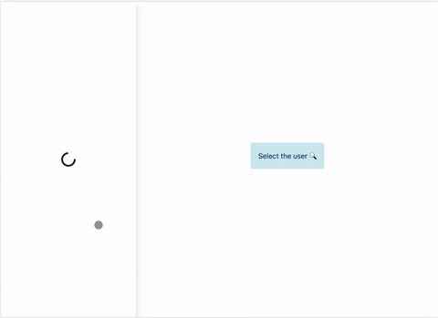
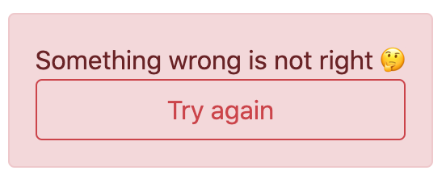
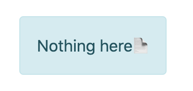

<div style="text-align:center">

# useReducer as Redux

This project is a sample of how to use useReducer with some practices provided by Redux, such as using `connect`, `combineReducers`, `useStore` and `useDisparch`




[](https://codesandbox.io/s/broken-silence-ijhfc)


</div>

## About
In addition to the reducer, this sample has a Status controlle, `src/components/Status.js` and `src/hooks/withStatus.js`

| Loading                             | Error                                  | Empty                                  | Render                                   |
| ----------------------------------- | -------------------------------------- | -------------------------------------- | ---------------------------------------- |
|  |  |  |  |


## Installation

You need the [node](https://nodejs.org/en/download/) to run this project, this example was created for the version `v12.18.2`.
If you prefer, you can check the code by running in the [sandbox](https://codesandbox.io/s/broken-silence-ijhfc)

```bash
npm install
npm start
```


## Licença 

The [MIT License]() (MIT)

Copyright :copyright: 2020